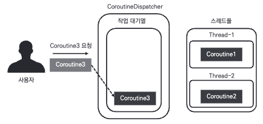
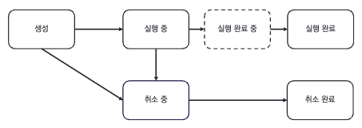

## 기본개념
1.Coroutine Scope  
-MainScope, GlobalScope  
2.Coroutine Builders  
-코루틴 생성 메소드(적절한 스레드에 작업전달)   
ex) launch, runblocking  
3.Coroutine Context  
-코루틴의 동작제어  
ex)job, dispatcher  

## 3장: CoroutineDispatcher(85~112)
[동작]  


[미리정의된 Dispatcher]

Dispatchers.IO  
-입출력작업 수행   
ex) 네트워크요청, 파일입출력  
Dispatchers.Default  
-CPU연산 작업 수행  
ex) json 파싱  
Dispatchers.Main  
-메인스레드 수행  
ex) UI작업  

## 4장: 코루틴 빌더와 Job(113~148)
[코루틴 생명주기]  


[Builder 함수]
join
-순차 처리 위해 사용
```kotlin
val testJob1 = launch(Dispatchers.IO) {
    println("${Thread.currentThread().name}/시작")
    delay(1000L)
    println("${Thread.currentThread().name}/종료")
}
testJob1.join()
val testJob2 = launch(Dispatchers.IO) {
    println("${Thread.currentThread().name}/실행")
}
```  
(책 소스코드 github에서 확인)  
joinAll  
-복수의 코루틴 실행완료까지 대기  
cancel  
-코루틴 취소  
cancelAndJoin  
-취소 완료될때까지 대기  
yield  
-확인  
delay  
-지연  

[job 프로퍼티]  
-코루틴의 상태를 확인하는 용도  
isActive  
isCancelled  
isCompleted  


#### 참고
- 구글 코루틴 가이드 : https://developer.android.com/kotlin/coroutines?hl=ko
  
- 책 소스 코드 : https://github.com/seyoungcho2/coroutinesbook