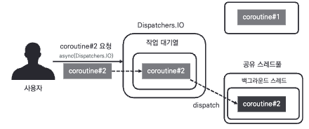
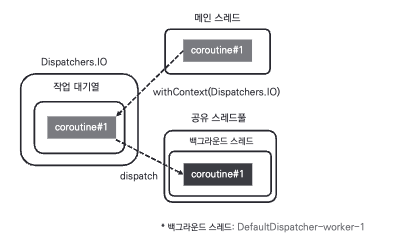

## 5장: async와 Deferred(149~172)
[요약]  
1.코루틴 반환값 받기   
2.코루틴 실행중인 스레드 변경하는 withContext 사용하는 방법  

1.코루틴 반환값 받기  
launch 는 결과값 직접 반환 불가  
```kotlin
val testJob = launch(Dispatchers.IO) {
    delay(1000L)
    println("${Thread.currentThread().name}")
    //return X
}
```  
async 는 결과값 직접 반환 가능  
Deferred 통해 타입 변환
```kotlin
val testService Deferred<String> = async(Dispatchers.IO) {
    delay(1000L)
    return@async "반환"
}
```

반환되는 결과값 수신 대기
```kotlin
//정의는 생략
testService.await() //개별 결과 대기
awaitAll(testService1, testService2 ...)  //여러 코루틴 결과 대기
```

2.코루틴 실행중인 스레드 변경하는 withContext  
코루틴 라이브러리에서 제공하는 withContext로 async-await 대체 가능  


async-await과 withContext 비교  
async-await    
[동작]  
  
[소스코드]
```kotlin
//정의는 생략
val serviceResult : Deferred<String> = async(Dispatchers.IO) {
    delay(1000L)
    return@async "반환"
}
serviceResult.await()
println(serviceResult)
```
withContext  
[동작]    
  
[소스코드]  
```kotlin
//정의는 생략
val serviceResult = withContext(Dispatchers.IO) {
    delay(1000L)
    return@withContext "반환"
}
println(serviceResult)
```
withContext 유의사항
새로운 코루틴을 만들지 않기에 순차적 진행
병렬처리 시 async 이용


----------------------------------
#### QA
Q1.async-await와 withContext 또다른 차이점은 뭘까?  
A1.예외처리  
async-await
```kotlin
val testJob = launch(Dispatchers.IO) { // 2. 여기까지 에러 전달
            try {
                async {
                    throw Exception() // 1. 여기서 에러를 발생시키면
                }
            } catch (e: Exception) {
                println("error 처리")  // 미처리
            }
        }
```  
withContext
```kotlin
val testJob = launch(Dispatchers.IO) {
            try {
                withContext(Dispatchers.Default) {
                    throw Exception()  // 1. 여기서 에러를 발생시키면
                }
            } catch (e: Exception) {
                println("error 처리")  // 처리
            }
            // 2. 에러 차리
        }
```       
-----------------------------


## 6장: CoroutineContext(173~192)
[요약]  
1.CoroutineContext의 구성요소  
2.CoroutineContext의 구성요소 결합하거나 분리하는 방법  

1.CoroutineContext 구성요소  
|구성요소|역할|
|------|---|
|CoroutineName|코루틴 이름 설정|
|Job|코루틴 조작|
|CoroutineDispatcher|코루틴 스레드 할당|
|CoroutineExceptionHandler|코루틴 예외처리|


2.CoroutineContext 구성방법  
CoroutineContext 객체는 키-값 쌍으로 구성

|Create|Read|Update|Delete|
|------|---|---|---|
||get 연산자|+ 연산자|minusKey|

get
```kotlin
val coroutine = CoroutineName("MycCoroutine")
println(coroutineName.Key)
println(coroutine[CoroutineName.Key])  //대괄호로 대체 가능
```       

+연산자
```kotlin
val coroutine1 = CoroutineName("MycCoroutine1") + newSingleThreadContext("Thread1")
val coroutine2 = CoroutineName("MycCoroutine2") + newSingleThreadContext("Thread2")
println(coroutine1 + coroutine2)
```       

-minusKey
```kotlin
val coroutine1 = CoroutineName("MycCoroutine1") + newSingleThreadContext("Thread1")
println(coroutine1.minusKey(CoroutineName))
```       


#### 참고
- 구글 코루틴 가이드 : https://developer.android.com/kotlin/coroutines?hl=ko
  
- 책 소스 코드 : https://github.com/seyoungcho2/coroutinesbook