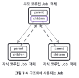
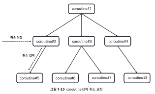

## 7장: 구조화된 동시성(193~256)
[요약]  
Job객체가 코루틴 구조화에 사용 -> 구조화된 코루틴 특징 -> CoroutineScope 객체 조작하는 것은 CoroutineContext 객체 속 Job 객체 조작하는 것 -> 코루틴 구조화 중심 Job 객체

#### 구조화된 동시성의 원칙이란?  
비동기 작업을 구조화하여 비동기 프로그래밍을 보다 안정적으로 예측할 수 있게 하는 원칙
부모-자식 관계로 구조화
(부모 코루틴 안에서 자식 코루틴 호출)  

[추가]  
코틀린 코루틴 가이드를 보면 대표적 기능 존재  
-경량  
-메모리 누수 감소  
-내장된 취소 지원  
(코루틴 손실, 누출 방지) 
CoroutineScope안에서만 코루틴 시작 가능


#### 구조화된 코루틴 특징
1)부모 코루틴 실행환경이 자식 코루틴에게 상속  
1-1: 부모 코루틴의 실행 환경 상속
```kotlin
fun main() = runBlocking<Unit> {
    val coroutineContext = CoroutineName("MyCoroutine")
    launch(coroutineContext) {  
        // 부모 코루틴
        println("${Thread.currentThread().name}")
        launch {
            // 자식 코루틴
            println("${Thread.currentThread().name}")
        }
    }
}
```  
1-2: 실행 환경 덮어씌우기
```kotlin
fun main() = runBlocking<Unit> {
    val coroutineContext = CoroutineName("MyCoroutine")
    launch(coroutineContext) {  
        // 부모 코루틴
        println("${Thread.currentThread().name}")
        launch(CoroutineName("Child")) {
            // 자식 코루틴 생성
            println("${Thread.currentThread().name}")
        }
    }
}
```  
1-3: 상속되지 않는 Job  
Job객체는 상속되지 않음  
```kotlin
fun main() = runBlocking<Unit> { // 부모 코루틴 생성
  val runBlockingJob = coroutineContext[Job] // 부모 코루틴의 CoroutineContext로부터 부모 코루틴의 Job 추출
  launch { // 자식 코루틴 생성
    val launchJob = coroutineContext[Job] // 자식 코루틴의 CoroutineContext로부터 자식 코루틴의 Job 추출
    if (runBlockingJob === launchJob) {
      println("runBlocking으로 생성된 Job과 launch로 생성된 Job이 동일합니다")
    } else {
      println("runBlocking으로 생성된 Job과 launch로 생성된 Job이 다릅니다")
    }
  }
}
```  
1-4: 구조화에 사용되는 Job  
   
|Job 프로퍼티|타입|설명|
|------|---|---|
|parent|Job?|코루틴은 부모 코루틴 없을 수 있고, 부모 코루틴 있더라도 한개|
|children|Sequence<Job>|하나의 코루틴은 복수의 자식 코루틴 가질 수있음|


2)작업 제어에 사용  
3)부모 코루틴 취소되면 자식 코루틴도 취소  
2-1, 3-1: 취소의 전파  
   
특정 코루틴 취소 요청되면 자식 코루틴 방향으로만 취소 요청 전파  

4)부모 코루틴은 자식 코루틴 완료될때까지 대기  
4-1: 부모 코루틴의 자식 코루틴에 대한 완료 의존성  
※ 부모 코루틴 실행 완료 시간 확인 위해 invokeOnCompletion 함수 사용(실행완료나 취소완료 시 콜백 수행)  
```kotlin
fun main() = runBlocking<Unit> {
  val startTime = System.currentTimeMillis()
  val parentJob = launch { // 부모 코루틴 실행
    launch { // 자식 코루틴 실행
      delay(1000L) // 1초간 대기
      println("[${getElapsedTime(startTime)}] 자식 코루틴 실행 완료")
    }
    println("[${getElapsedTime(startTime)}] 부모 코루틴이 실행하는 마지막 코드")
  }
  parentJob.invokeOnCompletion { // 부모 코루틴이 종료될 시 호출되는 콜백 등록
    println("[${getElapsedTime(startTime)}] 부모 코루틴 실행 완료")
  }
}
```  

#### 구조화 역할 하는 CoroutineScope
-CoroutineScope 객체는 자신의 범위 내 생성된 코루틴들에게 실행환경 제공, 실행범위 관리하는 역할

CoroutineScope 객체 만드는 2가지 방법  
1)CoroutineScope 인터페이스 이용  
CoroutineScope 인터페이스 선언 형태
```kotlin
public interface CoroutineScope {
    public val coroutineContext: CoroutineContext
}
```  
CoroutineScope 이용하여 Custom 클래스 생성 및 사용
```kotlin
class CustomCoroutineScope : CoroutineScope {
  override val coroutineContext: CoroutineContext = Job() +
      newSingleThreadContext("CustomScopeThread")
}

fun main() {
  val coroutineScope = CustomCoroutineScope() // CustomCoroutineScope 인스턴스화
  coroutineScope.launch {
    delay(100L) // 100밀리초 대기
    println("[${Thread.currentThread().name}] 코루틴 실행 완료")
  }
  Thread.sleep(1000L) // 코드 종료 방지
}

```  
2)CoroutineScope 함수 이용  
CoroutineScope 함수  
```kotlin
public fun CoroutineScope(context: CoroutineContext): CoroutineScope =
    ContextScope(if (context[Job] != null) context else context + Job())
    // Job이 설정돼 있지 않으면 새로운 Job 생성
```  

CoroutineScope 함수 사용하여 생성  
```kotlin
fun main() {
  val coroutineScope = CoroutineScope(Dispatchers.IO)
  coroutineScope.launch {
    delay(100L) // 100밀리초 대기
    println("[${Thread.currentThread().name}] 코루틴 실행 완료")
  }
  Thread.sleep(1000L)
}
```  

CoroutineScope가 코루틴에게 실행 환경 제공하는 방식  
launch : CoroutineScope 확장 함수로 선언  
launch 함수 호출시 :   
1.수신 객체인 CoroutineScope로부터 CoroutineContext 객체를 제공받는다.  
2.제공받은 CoroutineContext 객체에 launch 함수의 context 인자로 넘어온 CoroutineContext를 더한다.  
3.생성된 CoroutineContext에 코루틴 빌더 함수가 호출돼 새로 생성되는 Job을 더한다. 이때 CoroutineContext를 통해 전달되는 Job 객체는 새로 생성되는 Job 객체의 부모 Job 객체가 된다.  
```kotlin
public fun CoroutineScope.launch(
    context: CoroutineContext = EmptyCoroutineContext,
    start: CoroutineStart = CoroutineStart.DEFAULT,
    block: suspend CoroutineScope.() -> Unit
): Job {
    val newContext = newCoroutineContext(context)
    val coroutine = if (start.isLazy)
        LazyStandaloneCoroutine(newContext, block) else
        StandaloneCoroutine(newContext, active = true)
    coroutine.start(start, coroutine, block)
    return coroutine
}
```  

※ 람다식 this 통해 부모 코루틴의 실행 환경 상속


#### 코루틴 구조화 중심인 Job
코루틴 구조화가 중요한 이유 : 구조화가 깨지면 비동기 작업이 안전하지 않음  

Job 기능
-구조화  
-구조화 깨기  
-일부 코루틴 취소 되지 않게 하기  
--생성된 Job 부모 명시적 설정  
--생성된 Job 명시적 실행완료 처리

-구조화 꺠기  
1)CoroutineScope 사용
```kotlin
fun main() = runBlocking<Unit> { // 루트 Job 생성
  val newScope = CoroutineScope(Dispatchers.IO) // 새로운 루트 Job 생성
  newScope.launch(CoroutineName("Coroutine1")) { // Coroutine1 실행
    launch(CoroutineName("Coroutine3")) { // Coroutine3 실행
      delay(100L)
      println("[${Thread.currentThread().name}] 코루틴 실행")
    }
    launch(CoroutineName("Coroutine4")) { // Coroutine4 실행
      delay(100L)
      println("[${Thread.currentThread().name}] 코루틴 실행")
    }
  }
  newScope.launch(CoroutineName("Coroutine2")) { // Coroutine2 실행
    launch(CoroutineName("Coroutine5")) { // Coroutine5 실행
      delay(100L)
      println("[${Thread.currentThread().name}] 코루틴 실행")
    }
  }
}
```    
2)Job 사용
```kotlin
fun main() = runBlocking<Unit> {
  val newRootJob = Job() // 새로운 루트 Job 생성
  launch(CoroutineName("Coroutine1") + newRootJob) {
    launch(CoroutineName("Coroutine3")) {
      delay(100L)
      println("[${Thread.currentThread().name}] 코루틴 실행")
    }
    launch(CoroutineName("Coroutine4")) {
      delay(100L)
      println("[${Thread.currentThread().name}] 코루틴 실행")
    }
  }
  launch(CoroutineName("Coroutine2") + newRootJob) {
    launch(CoroutineName("Coroutine5")) {
      delay(100L)
      println("[${Thread.currentThread().name}] 코루틴 실행")
    }
  }
  newRootJob.cancel() // 새로운 루트 Job 취소
  delay(1000L)
}
```  

-일부 코루틴 취소 되지 않게 하기  
```kotlin
fun main() = runBlocking<Unit> {
  val newRootJob = Job() // 새로운 루트 Job 생성
  launch(CoroutineName("Coroutine1") + newRootJob) {
    launch(CoroutineName("Coroutine3")) {
      delay(100L)
      println("[${Thread.currentThread().name}] 코루틴 실행")
    }
    launch(CoroutineName("Coroutine4")) {
      delay(100L)
      println("[${Thread.currentThread().name}] 코루틴 실행")
    }
  }
  launch(CoroutineName("Coroutine2") + newRootJob) {
    launch(CoroutineName("Coroutine5") + Job()) {
      delay(100L)
      println("[${Thread.currentThread().name}] 코루틴 실행")
    }
  }
  delay(50L) // 모든 코루틴이 생성될 때까지 대기
  newRootJob.cancel() // 새로운 루트 Job 취소
  delay(1000L)
}
``` 

--생성된 Job 부모 명시적 설정  
```kotlin
fun main() = runBlocking<Unit> {
  launch(CoroutineName("Coroutine1")) {
    val coroutine1Job = this.coroutineContext[Job] // Coroutine1의 Job
    val newJob = Job(parent = coroutine1Job)
    launch(CoroutineName("Coroutine2") + newJob) {
      delay(100L)
      println("[${Thread.currentThread().name}] 코루틴 실행")
    }
  }
}
``` 
--생성된 Job 명시적 실행완료 처리  
이유: 생성된 Job객체는 자동으로 실행완료 처리 되지 않기에 명시적 완료함수 사용
```kotlin
fun main() = runBlocking<Unit> {
  launch(CoroutineName("Coroutine1")) {
    val coroutine1Job = this.coroutineContext[Job]
    val newJob = Job(coroutine1Job)
    launch(CoroutineName("Coroutine2") + newJob) {
      delay(100L)
      println("[${Thread.currentThread().name}] 코루틴 실행")
    }
    newJob.complete() // 명시적으로 완료 호출
  }
}
``` 

[추가]
runBlock vs launch  
runBlocking : 생성된 코루틴 완료될떄까지 스레드 차단하여 사용  
launch : 스레드 차단하지 않고 사용  


#### 참고
- 구글 코루틴 가이드 : https://developer.android.com/kotlin/coroutines?hl=ko
  
- 책 소스 코드 : https://github.com/seyoungcho2/coroutinesbook

- Swift에서의 구조적 동시성 : https://developer.apple.com/kr/videos/play/wwdc2023/10170/