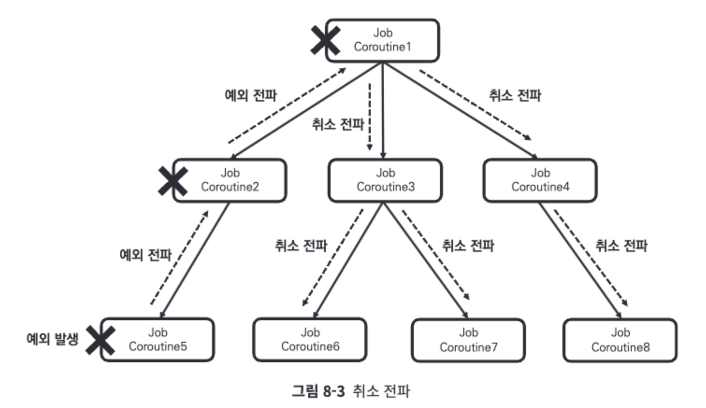

8장: 예외 처리(257~300)
```kotlin
```  
[예외 처리]  
애플리케이션 다양 예외 상황으로부터 안정성 확보 위해 예외처리 필요

[예외 전파]  
코루틴에서 발생한 예외는 부모 코루틴으로 전파

예외 발생하여 예외 전파시 
   

[예외 전파 제한]  
구조화로 예외 발생시 구조화된 코루틴 모든 코루틴이 취소되기 때문에 구조화를 깨트려 예외 전파를 제한  
-방법  
1)Job객체 사용  
```kotlin
fun main() = runBlocking<Unit> {
  val parentJob = launch(CoroutineName("Parent Coroutine")) {
    launch(CoroutineName("Coroutine1") + Job()) {
      launch(CoroutineName("Coroutine3")) { // Coroutine3에서 예외 제거
        delay(100L)
        println("[${Thread.currentThread().name}] 코루틴 실행")
      }
      delay(100L)
      println("[${Thread.currentThread().name}] 코루틴 실행")
    }
    launch(CoroutineName("Coroutine2")) {
      delay(100L)
      println("[${Thread.currentThread().name}] 코루틴 실행")
    }
  }
  delay(20L) // 코루틴들이 모두 생성될 때까지 대기
  parentJob.cancel() // Parent Coroutine에 취소 요청
  delay(1000L)
}
/*
// 결과:
[main @Coroutine1#3] 코루틴 실행
[main @Coroutine3#5] 코루틴 실행

Process finished with exit code 0
*/
```  
   
2)SupervisorJob객체 사용  
2-1 구조화 X  
```kotlin
fun main() = runBlocking<Unit> {
    val supervisorJob = SupervisorJob()
    launch(CoroutineName("Coroutine1") + supervisorJob) {
        launch(CoroutineName("Coroutine3")) {
            throw Exception("예외 발생")
        }
        delay(100L)
        println("[${Thread.currentThread().name}] 코루틴 실행")
    }
    launch(CoroutineName("Coroutine2") + supervisorJob) {
        delay(100L)
        println("[${Thread.currentThread().name}] 코루틴 실행")
    }
    delay(1000L)
}
/*
// 결과:
Exception in thread "main" java.lang.Exception: 예외 발생
	at chapter8.code4.Code8_4Kt$main$1$1$1.invokeSuspend(Code8-4.kt:9)
	at kotlin.coroutines.jvm.internal.BaseContinuationImpl.resumeWith(ContinuationImpl.kt:33)
	...
[main @Coroutine2#3] 코루틴 실행

Process finished with exit code 0
*/
```  
   
2-2 구조화 O  
```kotlin
fun main() = runBlocking<Unit> {
    // supervisorJob의 parent로 runBlocking으로 생성된 Job 객체 설정
    val supervisorJob = SupervisorJob(parent = this.coroutineContext[Job])
    launch(CoroutineName("Coroutine1") + supervisorJob) {
        launch(CoroutineName("Coroutine3")) {
            throw Exception("예외 발생")
        }
        delay(100L)
        println("[${Thread.currentThread().name}] 코루틴 실행")
    }
    launch(CoroutineName("Coroutine2") + supervisorJob) {
        delay(100L)
        println("[${Thread.currentThread().name}] 코루틴 실행")
    }
    supervisorJob.complete() // supervisorJob 완료 처리
}
/*
// 결과:
Exception in thread "main" java.lang.Exception: 예외 발생
	at chapter8.code5.Code8_5Kt$main$1$1$1.invokeSuspend(Code8-5.kt:9)
	at kotlin.coroutines.jvm.internal.BaseContinuationImpl.resumeWith(ContinuationImpl.kt:33)
	...
[main @Coroutine2#3] 코루틴 실행

Process finished with exit code 0
*/
```  
   
3)supervisorScope  
SupervisorJob객체를 가진 CoroutineScope객체 생성하여 예외전파 제한  
```kotlin
fun main() = runBlocking<Unit> {
    supervisorScope {
        launch(CoroutineName("Coroutine1")) {
            launch(CoroutineName("Coroutine3")) {
                throw Exception("예외 발생")
            }
            delay(100L)
            println("[${Thread.currentThread().name}] 코루틴 실행")
        }
        launch(CoroutineName("Coroutine2")) {
            delay(100L)
            println("[${Thread.currentThread().name}] 코루틴 실행")
        }
    }
}
/*
// 결과:
Exception in thread "main" java.lang.Exception: 예외 발생
	at chapter8.code8.Code8_8Kt$main$1$1$1$1.invokeSuspend(Code8-8.kt:9)
	at kotlin.coroutines.jvm.internal.BaseContinuationImpl.resumeWith(ContinuationImpl.kt:33)
	...
[main @Coroutine2#3] 코루틴 실행

Process finished with exit code 0
*/
```  
  
[CoroutineExceptionHandler]  
공통적으로 예외 처리 하기위해 CoroutineExceptionHandler 사용  
SupervisorJob 객체를 가진 CoroutineScope 객체 생성하여 예외전파 제한  
```kotlin
fun main() = runBlocking<Unit> {
    val exceptionHandler = CoroutineExceptionHandler { coroutineContext, throwable ->
        println("[예외 발생] ${throwable}")
    }
    CoroutineScope(exceptionHandler).launch(CoroutineName("Coroutine1")) {
        throw Exception("Coroutine1에 예외가 발생했습니다")
    }
    delay(1000L)
}
/*
// 결과:
[예외 발생] java.lang.Exception: Coroutine1에 예외가 발생했습니다
*/
```  
만약 자식 코루틴이 부모 코루틴으로 예외를 전파하면 자식 코루틴에서는 예외가 처리된 것으로 봐 자식 코루틴에 설정된 CoroutineExceptionHandler 객체는 동작하지 않음  
```kotlin
fun main() = runBlocking<Unit> {
    val exceptionHandler = CoroutineExceptionHandler { coroutineContext, throwable ->
        println("[예외 발생] ${throwable}")
    }
    launch(CoroutineName("Coroutine1") + exceptionHandler) {
        throw Exception("Coroutine1에 예외가 발생했습니다")
    }
    delay(1000L)
}
/*
// 결과:
Exception in thread "main" java.lang.Exception: Coroutine1에 예외가 발생했습니다
	at chapter8.code10.Main8_10Kt$main$1$1.invokeSuspend(Main8-10.kt:10)
	at kotlin.coroutines.jvm.internal.BaseContinuationImpl.resumeWith(ContinuationImpl.kt:33)
	...
*/
```  


CoroutineExceptionHandler 객체가 예외를 처리하게 하는 방법 2가지 존재  
1-Job이용 2-SupervisorJob이용  
1)Job이용  
-Job()을 호출하면 새로운 루트 Job을 만들 수 있으므로 이를 사용하면 CoroutineExceptionHandler 객체가 설정되는 위치를 코루틴에서 오류가 처리되는 위치로 만들 수 있음  

```kotlin
fun main() = runBlocking<Unit> {
    val exceptionHandler = CoroutineExceptionHandler { coroutineContext, throwable ->
        println("[예외 발생] ${throwable}")
    }
    CoroutineScope(exceptionHandler).launch(CoroutineName("Coroutine1")) {
        throw Exception("Coroutine1에 예외가 발생했습니다")
    }
    delay(1000L)
}
/*
// 결과:
[예외 발생] java.lang.Exception: Coroutine1에 예외가 발생했습니다
*/
```  
2)SupervisorJob이용  
-SupervisorJob 객체는 예외를 전파받지 않을 뿐, 어떤 예외가 발생했는지에 대한 정보를 자식 코루틴으로부터 전파받음  
따라서 만약 SupervisorJob 객체와 CoroutineExceptionHandler 객체가 함께 설정되면 예외가 처리  
```kotlin
fun main() = runBlocking<Unit> {
    val exceptionHandler = CoroutineExceptionHandler { coroutineContext, throwable ->
        println("[예외 발생] ${throwable}")
    }
    val supervisedScope = CoroutineScope(SupervisorJob() + exceptionHandler)
    supervisedScope.apply {
        launch(CoroutineName("Coroutine1")) {
            throw Exception("Coroutine1에 예외가 발생했습니다")
        }
        launch(CoroutineName("Coroutine2")) {
            delay(100L)
            println("[${Thread.currentThread().name}] 코루틴 실행")
        }
    }
    delay(1000L)
}
/*
// 결과:
[예외 발생] java.lang.Exception: Coroutine1에 예외가 발생했습니다
[DefaultDispatcher-worker-2] 코루틴 실행
*/
```  
CoroutineExceptionHandler는 예외전파를 제한하지않음
CoroutineExceptionHandler는 try-catch문처럼 동작하지 않음  
예외가 마지막으로 처리되는 위치에서 예외를 처리할 뿐, 예외 전파를 제한하지 않음  

```kotlin
fun main() = runBlocking<Unit> {
    val exceptionHandler = CoroutineExceptionHandler { coroutineContext, throwable ->
        println("[예외 발생] ${throwable}")
    }
    launch(CoroutineName("Coroutine1") + exceptionHandler) {
        throw Exception("Coroutine1에 예외가 발생했습니다")
    }
}
/*
// 결과:
Exception in thread "main" java.lang.Exception: Coroutine1에 예외가 발생했습니다
	at chapter8.code13.Main8_13Kt$main$1$1.invokeSuspend(Main8-13.kt:10)
  ...
*/
```  

[try-catch문 사용한 예외 처리]  
코루틴 예외처리를 try-catch문으로 처리할때   
```kotlin
fun main() = runBlocking<Unit> {
    launch(CoroutineName("Coroutine1")) {
        try {
            throw Exception("Coroutine1에 예외가 발생했습니다")
        } catch (e: Exception) {
            println(e.message)
        }
    }
    launch(CoroutineName("Coroutine2")) {
        delay(100L)
        println("Coroutine2 실행 완료")
    }
}
/*
// 결과:
Coroutine1에 예외가 발생했습니다
Coroutine2 실행 완료
*/
```  
try-catch문으로 예외처리시 주의할점 : 코루틴 빌더 함수에 사용시 처리불가  
빌더 함수의 람다식 내부에서만 사용가능  
```kotlin
fun main() = runBlocking<Unit> {
    try {
        launch(CoroutineName("Coroutine1")) {
            throw Exception("Coroutine1에 예외가 발생했습니다")
        }
    } catch (e: Exception) {
        println(e.message)
    }
    launch(CoroutineName("Coroutine2")) {
        delay(100L)
        println("Coroutine2 실행 완료")
    }
}
/*
// 결과:
Exception in thread "main" java.lang.Exception: Coroutine1에 예외가 발생했습니다
	at chapter8.code15.Main8_15Kt$main$1$1.invokeSuspend(Main8-15.kt:8)
	at kotlin.coroutines.jvm.internal.BaseContinuationImpl.resumeWith(ContinuationImpl.kt:33)
	...

Process finished with exit code 1
*/
```  

[async 예외 처리]  
async 코루틴 빌더 함수는 결괏값을 Deferred 객체로 감싸고 await 호출 시점에 결괏값을 노출  
```kotlin
fun main() = runBlocking<Unit> {
    supervisorScope {
        val deferred: Deferred<String> = async(CoroutineName("Coroutine1")) {
            throw Exception("Coroutine1에 예외가 발생했습니다")
        }
        try {
            deferred.await()
        } catch (e: Exception) {
            println("[노출된 예외] ${e.message}")
        }
    }
}
/*
// 결과:
[노출된 예외] Coroutine1에 예외가 발생했습니다
*/
```  
주의할점 : async 코루틴 빌더 함수도 예외가 발생하면 부모 코루틴으로 예외를 전파하기에
await함수 호출부분에만 예외처리 하면 안됨
```kotlin
fun main() = runBlocking<Unit> {
    async(CoroutineName("Coroutine1")) {
        throw Exception("Coroutine1에 예외가 발생했습니다")
    }
    launch(CoroutineName("Coroutine2")) {
        delay(100L)
        println("[${Thread.currentThread().name}] 코루틴 실행")
    }
}
/*
// 결과:
Exception in thread "main" java.lang.Exception: Coroutine1에 예외가 발생했습니다
	at chapter8.code17.Main8_17Kt$main$1$1.invokeSuspend(Main8-17.kt:7)
	at kotlin.coroutines.jvm.internal.BaseContinuationImpl.resumeWith(ContinuationImpl.kt:33)
	...

Process finished with exit code 1
*/
```  
supervisorScope 사용하여 async 예외처리  
```kotlin
fun main() = runBlocking<Unit> {
    supervisorScope {
        async(CoroutineName("Coroutine1")) {
            throw Exception("Coroutine1에 예외가 발생했습니다")
        }
        launch(CoroutineName("Coroutine2")) {
            delay(100L)
            println("[${Thread.currentThread().name}] 코루틴 실행")
        }
    }
}
/*
// 결과:
[main @Coroutine2#3] 코루틴 실행
*/
```  

[CancellationException]  
특별한 예외  
코루틴은 CancellationException 예외 발생시 부모 코루틴으로 전파하지 않음  
```kotlin
fun main() = runBlocking<Unit>(CoroutineName("runBlocking 코루틴")) {
    launch(CoroutineName("Coroutine1")) {
        launch(CoroutineName("Coroutine2")) {
            throw CancellationException()
        }
        delay(100L)
        println("[${Thread.currentThread().name}] 코루틴 실행")
    }
    delay(100L)
    println("[${Thread.currentThread().name}] 코루틴 실행")
}
/*
// 결과:
[main @runBlocking 코루틴#1] 코루틴 실행
[main @Coroutine1#2] 코루틴 실행
*/
```  

Job 객체에 대해 cancel 함수를 호출시 CancellationException의 서브 클래스인 JobCancellationException을 발생시켜 코루틴을 취소  
```kotlin
fun main() = runBlocking<Unit> {
    val job = launch {
        delay(1000L) // 1초간 지속
    }
    job.invokeOnCompletion { exception ->
        println(exception) // 발생한 예외 출력
    }
    job.cancel() // job 취소
}
/*
// 결과:
kotlinx.coroutines.JobCancellationException: StandaloneCoroutine was cancelled; job=StandaloneCoroutine{Cancelled}@7494e528
*/
```  

[시간제한]
제한 시간을 두고 작업을 실행할 수 있도록 만드는 withTimeOut 함수를 존재  
네트워크 호출의 실행 시간을 제한하는 데 사용할 수 있음  
withTimeOut
```kotlin
fun main() = runBlocking<Unit>(CoroutineName("Parent Coroutine")) {
    launch(CoroutineName("Child Coroutine")) {
        withTimeout(1000L) { // 실행 시간을 1초로 제한
            delay(2000L) // 2초의 시간이 걸리는 작업
            println("[${Thread.currentThread().name}] 코루틴 실행")
        }
    }
    delay(2000L)
    println("[${Thread.currentThread().name}] 코루틴 실행")
}
/*
// 결과:
[main @Parent Coroutine#1] 코루틴 실행
*/
```  
결과값이 필요할경우 withTimeOutOrNull 사용  
```kotlin
fun main() = runBlocking<Unit>(CoroutineName("Parent Coroutine")) {
    launch(CoroutineName("Child Coroutine")) {
        val result = withTimeoutOrNull(1000L) { // 실행 시간을 1초로 제한
            delay(2000L) // 2초의 시간이 걸리는 작업
            return@withTimeoutOrNull "결과"
        }
        println(result)
    }
}
/*
// 결과:
null
*/
```  

--------

9장: 일시 중단 함수(301~316)

[정의]  
suspend fun 키워드 사용  
코루틴이 아닌 코드를 재사용이 가능한 단위로 만들어 구조화하는데 사용  

```kotlin
//일시 중단 함수 선언
suspend fun delayTest() {
    delay(1000L)
    println("delay")
}
//매개변수도 사용가능
suspend fun delayTest(title: String) {
    delay(1000L)
    println(title)
}
fun main() = runBlocking<Unit> {
    delayTest()
    delayTest("hello")
}
```  
[호출가능 시점]  
1.코루틴 내부  
```kotlin
fun main() = runBlocking<Unit> {
    delayAndPrint(keyword = "I'm Parent Coroutine")
    launch {
        delayAndPrint(keyword = "I'm Child Coroutine")
    }
}

suspend fun delayAndPrint(keyword: String) {
    delay(1000L)
    println(keyword)
}

/*
// 결과:
I'm Parent Coroutine
I'm Child Coroutine
*/
```  
2.일시 중단 함수  
```kotlin
suspend fun searchByKeyword(keyword: String): Array<String> {
    val dbResults = searchFromDB(keyword)
    val serverResults = searchFromServer(keyword)
    return arrayOf(*dbResults, *serverResults)
}

suspend fun searchFromDB(keyword: String): Array<String> {
    delay(1000L)
    return arrayOf("[DB]${keyword}1", "[DB]${keyword}2")
}

suspend fun searchFromServer(keyword: String): Array<String> {
    delay(1000L)
    return arrayOf("[Server]${keyword}1", "[Server]${keyword}2")
}
```  
코루틴 빌더 함수 CoroutineScope 확장 함수로 되어있기때문 일시 중단 함수 사용 불가  
사용하려면 coroutineScope 이용  
```kotlin
suspend fun searchByKeyword(keyword: String): Array<String> = coroutineScope { // this: CoroutineScope
    val dbResultsDeferred = async {
        searchFromDB(keyword)
    }
    val serverResultsDeferred = async {
        searchFromServer(keyword)
    }

    return@coroutineScope arrayOf(*dbResultsDeferred.await(), *serverResultsDeferred.await())
}
```  
supervisorScope 일시 중단 함수는 Job 대신 SupervisorJob 객체를 생성한다는 점을 제외하고는 coroutineScope 일시 중단 함수와 같이 동작  
```kotlin
suspend fun searchByKeyword(keyword: String): Array<String> = supervisorScope { // this: CoroutineScope
    val dbResultsDeferred = async {
        throw Exception("dbResultsDeferred에서 예외가 발생했습니다")
        searchFromDB(keyword)
    }
    val serverResultsDeferred = async {
        searchFromServer(keyword)
    }

    val dbResults = try {
        dbResultsDeferred.await()
    } catch (e: Exception) {
        arrayOf() // 예외 발생 시 빈 결과 반환
    }

    val serverResults = try {
        serverResultsDeferred.await()
    } catch (e: Exception) {
        arrayOf() // 에러 발생 시 빈 결과 반환
    }

    return@supervisorScope arrayOf(*dbResults, *serverResults)
}
```