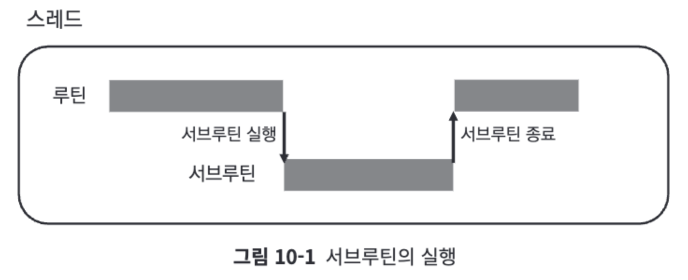
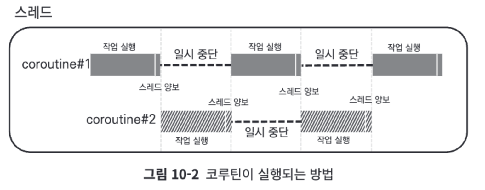
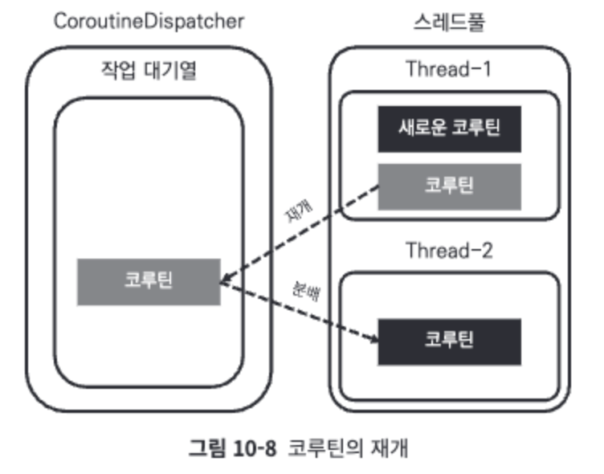
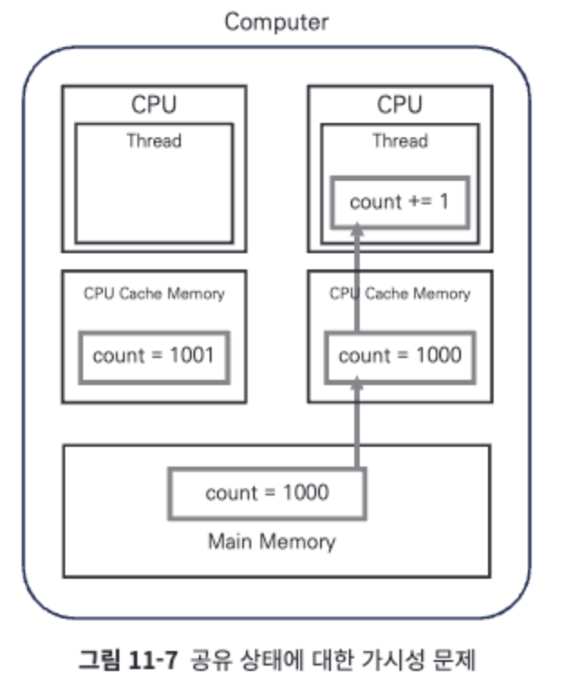
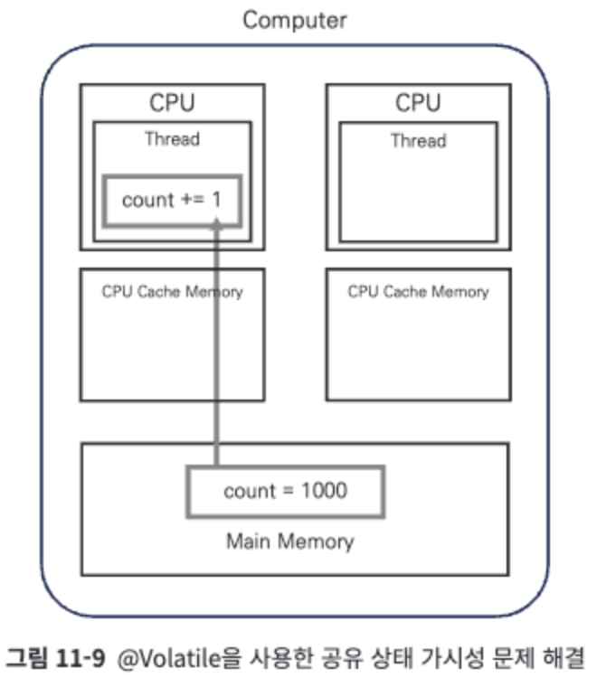
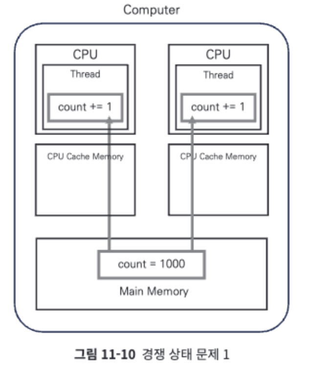
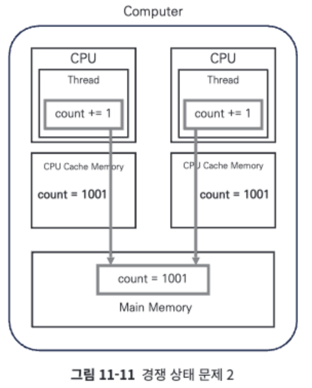

# 10장: 코루틴의 이해(317~336)

## 루틴,서브루틴,코루틴  
루틴 : 특정한 일을 처리하기 위한 함수 또는 메서드  
서브루틴 : 함수 내에서 함수가 호출될 경우 호출되는 함수   
코루틴 : 함께(Co)실행되는 루틴  

|     |         서브루틴          |          코루틴          |
|:---:|:---------------------:|:---------------------:|
| 개념도 |  |  |
| 동작  |     완료때까지 다른작업불가      |    스레드 간 양보 함께 실행     |

## 스레드 양보  
  
- 스레드를 양보시 실행 스레드는 변경 될 수 있음  

[내부적 스레드 양보]  
1)delay  
- 스레드를 양보하고 일정 시간 일시 정지  
※ Thread.sleep은 스레드를 양보하지 않고 블로킹  
2)join  
3)await  
- join,await의 코루틴 완료될때까지 스레드 양보하고 일시중단  

[직접 스레드 양보 호출]  
4)yield  
- 스레드 권한 명시적 양보

--------

# 11장: 코루틴 심화(337~380)

## 멀티스레드 환경 - 공유상태에서 문제점
- 멀티스레드 환경에서는 동시성 문제 존재(데이터 동기화)

### 1.메모리 가시성  
- CPU캐시와 메인 메모리 간 데이터 불일치  
  
해결방법 : @Volatile 어노테이션 사용  
  
```kotlin
@Volatile
var count = 0

fun main() = runBlocking<Unit> {
  withContext(Dispatchers.Default) {
    repeat(10_000) {
      launch {
        count += 1
      }
    }
  }
  println("count = ${count}")
}
/*
// 결과:
count = 9122
*/
```  

### 2.경쟁 상태  
2-1)연산 중복실행  
  
2-2)연산 중복적용  
  
해결방법 : 1)Mutex 사용 2)전용 스레드 사용  
1)Mutex 사용  
- lock, unlock 통해 코드 블록  
1-1)lock, unlcok 직접호출  
1-2)withLock 일시함수 사용  
```kotlin
var count = 0
val mutex = Mutex()

fun main() = runBlocking<Unit> {
    withContext(Dispatchers.Default) {
        repeat(10_000) {
            launch {
                //1-1 : 직접호출
                mutex.lock() // 임계 영역 시작 지점
                count += 1
                mutex.unlock() // 임계 영역 종료 지점

                //1-2 : withLock 일시함수 사용
                mutex.withLock {
                    count += 1
                }
            }
        }
    }
    println("count = ${count}")
}
/*
// 결과:
count = 10000
*/
```  

#### + ReentrantLock
- 자바의 스레드 기반 동시성 제어를 위해 설계된 클래스
- lock이 해제될떄까지 스레드 블로킹을 하기에 Mutex를 더사용
```kotlin
var count = 0
val reentrantLock = ReentrantLock()

fun main() = runBlocking<Unit> {
    withContext(Dispatchers.Default) {
        repeat(10_000) {
            launch {
                reentrantLock.lock() // 스레드를 블록하고 기존의 락이 해제될 때까지 기다림
                count += 1
                reentrantLock.unlock()
            }
        }
    }
    println("count = ${count}")
}
/*
// 결과:
count = 10000
*/
```  

2)전용 스레드 사용  
- 공유상태 접근을 하나의 전용스레드로 강제, newSingleThreadContext 사용   
```kotlin
var count = 0
val countChangeDispatcher = newSingleThreadContext("CountChangeThread")

fun main() = runBlocking<Unit> {
    withContext(Dispatchers.Default) {
        repeat(10_000) {
            launch { // count 값을 변경 시킬 때만 사용
                increaseCount()
            }
        }
    }
    println("count = ${count}")
}

suspend fun increaseCount() = coroutineScope {
    withContext(countChangeDispatcher) {
        count += 1
    }
}
/*
// 결과:
count = 10000
*/
```  
## AtomicInteger 원자성 객체 사용
```kotlin
var count = AtomicInteger(0)

fun main() = runBlocking<Unit> {
    withContext(Dispatchers.Default) {
        repeat(10_000) {
            launch {
                count.getAndUpdate { // 만약 다른 스레드가 연산을 실행 중이면 코루틴은 스레드를 블로킹 시키고 대기한다.
                    it + 1 // count값 1 더하기
                }
            }
        }
    }
    println("count = ${count}")
}
/*
// 결과:
count = 10000
*/
```  
- 복잡한 객체 이용시
```kotlin
data class Counter(val name: String, val count: Int)
val atomicCounter = AtomicReference(Counter("MyCounter", 0)) // 원자성 있는 Counter 만들기

fun main() = runBlocking<Unit> {
    withContext(Dispatchers.Default) {
        repeat(10_000) {
            launch {
                atomicCounter.getAndUpdate {
                    it.copy(count = it.count + 1) // MyCounter의 count값 1 더하기
                }
            }
        }
    }
    println(atomicCounter.get())
}
/*
// 결과:
Counter(name=MyCounter, count=10000)
*/
```  

## CoroutineStart 옵션
### CoroutineStart.DEFAULT
- 기본 default 값  
[동작절차] launch 예약 -> runBlocking 수행
```kotlin
fun main() = runBlocking<Unit> {
    launch {
        println("작업1")
    }
    println("작업2")
}
/*
// 결과:
작업2
작업1
*/
```  
### CoroutineStart.ATOMIC
- 실행 대기 상태에서 취소 방지시 사용  
```kotlin
fun main() = runBlocking<Unit> {
    val job = launch(start = CoroutineStart.ATOMIC) {
        println("작업1")
    }
    job.cancel() // 실행 대기 상태의 코루틴에 취소 요청
    println("작업2")
}
/*
// 결과:
작업2
작업1
*/
```  
### CoroutineStart.UNDISPATCHED
- CoroutineDispatcher 할당하지 않고 바로 스레드 할당  
```kotlin
fun main() = runBlocking<Unit> {
    launch(start = CoroutineStart.UNDISPATCHED) {
        println("작업1")
    }
    println("작업2")
}
/*
// 결과:
작업1
작업2
*/
```  

## 무제한 디스패처
- Dispatchers.Unconfined  
- 자신을 실행시킨 스레드에서 즉시 실행하도록 만드는 디스패처

### 무제한 디스패처 특징
1.코루틴이 자신을 생성한 스레드에서 즉시 실행
```kotlin
fun main() = runBlocking<Unit>(Dispatchers.IO) {
    println("runBlocking 코루틴 실행 스레드: ${Thread.currentThread().name}") // runBlocking 코루틴이 실행되는 스레드 출력
    launch(Dispatchers.Unconfined) { // Dispatchers.Unconfined를 사용해 실행되는 코루틴
        println("launch 코루틴 실행 스레드: ${Thread.currentThread().name}") // launch 코루틴이 실행되는 스레드 출력
    }
}
/*
// 결과:
runBlocking 코루틴 실행 스레드: DefaultDispatcher-worker-1 @coroutine#1
launch 코루틴 실행 스레드: DefaultDispatcher-worker-1 @coroutine#2
*/
```  
2.중단 시점 이후의 재개는 코루틴을 재개하는 스레드에서 한다
```kotlin
fun main() = runBlocking<Unit> {
    launch(Dispatchers.Unconfined) {
        println("일시 중단 전 실행 스레드: ${Thread.currentThread().name}")
        delay(100L)
        println("일시 중단 후 실행 스레드: ${Thread.currentThread().name}")
    }
}
/*
// 결과:
일시 중단 전 실행 스레드: main
일시 중단 후 실행 스레드: kotlinx.coroutines.DefaultExecutor
*/
```  
#### + CoroutineStart.UNDISPATCHED와 무제한 디스패처 차이
|     | CoroutineStart.UNDISPATCHED |   무제한 디스패처   |
|:---:|:---------------------------:|:------------:|
| 차이점 |  자신이 실행되는 디스패처 객체  | 자신을 재개시킨 스레드 |

## Continuation
- 코루틴은 CPS(Continuation Passing Style)이라는 프로그래밍 방식 통해 코루틴의 실행정보를 저장 및 전달 역할 수행
- 코루틴의 일시 중단 시점에 코루틴의 실행 상태 저장, 다음 실행해야 할 작업 정보 


### 코루틴의 일시 중단과 재개
- 코루틴 저수준 API 통해 확인
```kotlin
fun main() = runBlocking<Unit> {
    println("runBlocking 코루틴 일시 중단 호출")
    suspendCancellableCoroutine<Unit> { continuation: CancellableContinuation<Unit> ->
        println("일시 중단 시점의 runBlocking 코루틴 실행 정보: ${continuation.context}")
        continuation.resume(Unit) // 코루틴 재개 호출
    }
    println("runBlocking 코루틴 재개 후 실행되는 코드")
}
/*
// 결과:
runBlocking 코루틴 일시 중단 호출
일시 중단 시점의 runBlocking 코루틴 실행 정보: [BlockingCoroutine{Active}@551aa95a, BlockingEventLoop@35d176f7]
runBlocking 코루틴 재개 후 실행되는 코드

Process finished with exit code 0
*/
```  

### 다른 작업으로부터 결과 수신하여 코루틴 재개
```kotlin
fun main() = runBlocking<Unit> {
    println("runBlocking 코루틴 일시 중단 호출")
    val result = suspendCancellableCoroutine<String> { continuation: CancellableContinuation<String> ->
        println("일시 중단 시점의 runBlocking 코루틴 실행 정보: ${continuation.context}")
        continuation.resume(value ="실행 결과", onCancellation = null) // onCancellation은 코루틴이 취소될 때 호출되는 콜백 함수이다.
    }
    println("runBlocking 코루틴 재개 후 실행되는 코드: $result")
}
/*
// 결과:
runBlocking 코루틴 일시 중단 호출
일시 중단 시점의 runBlocking 코루틴 실행 정보: [BlockingCoroutine{Active}@551aa95a, BlockingEventLoop@35d176f7]
runBlocking 코루틴 재개 후 실행되는 코드: 실행 결과

Process finished with exit code 0
*/
```  