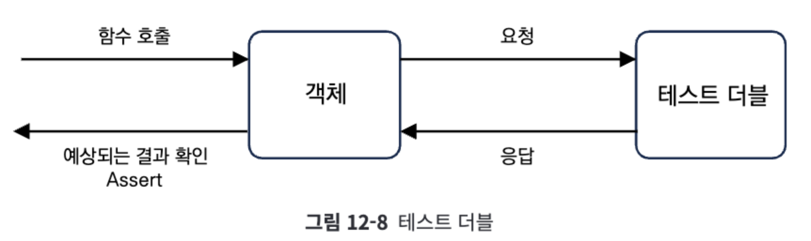
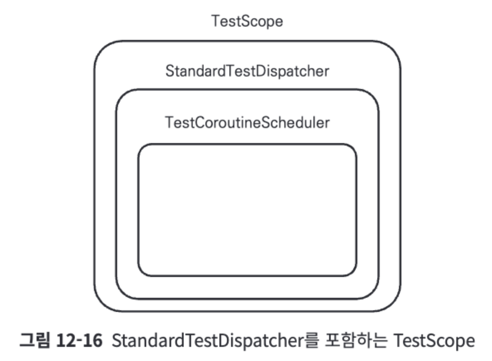
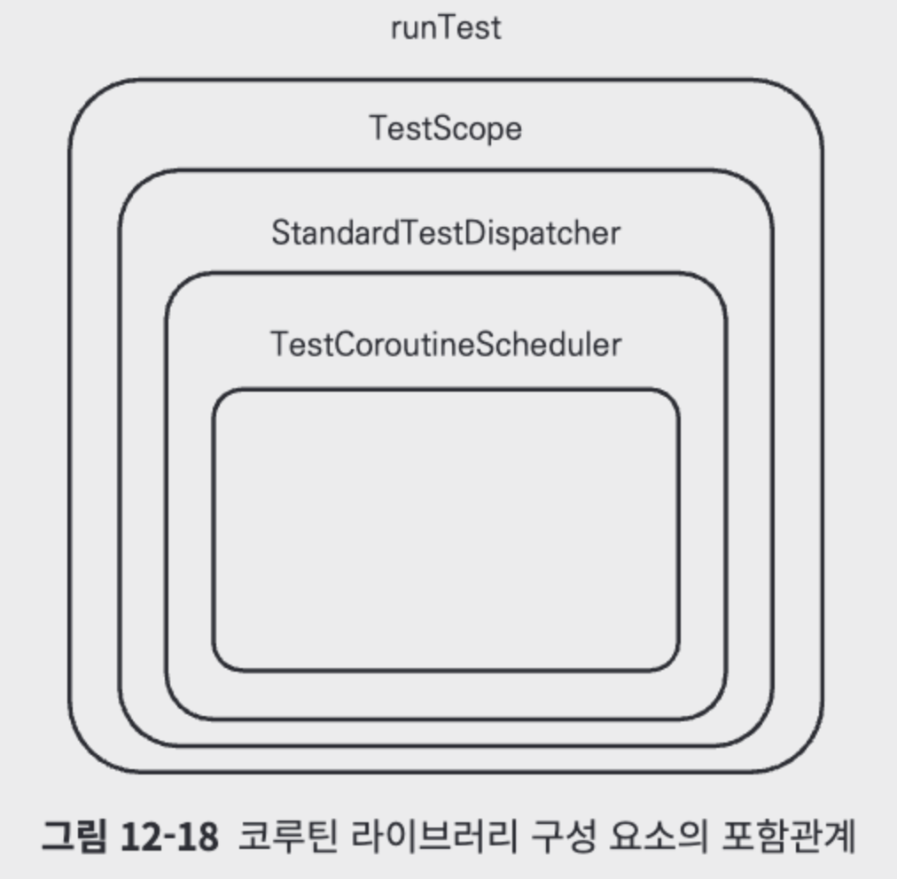

# 12장: 코루틴 단위 테스트(381~442)

## 단위 테스트
- 소프트웨어의 특정기능을 의도한대로 동작하는지 단위형태로 검증하는 테스트

assertEquals

## 테스트 더블
- 다른 객체와의 의존성 가진 객체 테스트 위해 모방하는 객체를 만들어 검증하는 테스트
- 
- Mockito, MockK 라이브러리 통해 구현가능

### 테스트 더블 종류
- 스텁(Stub)
미리 정의된 데이터 반환하는 모방객체
- 페이크(Fake)
실제 객체와 비슷하게 동자하도록 구현된 모방객체
- 목(Mock)
- 더미(Dummy)
- 스파이(Spy)

### 테스트 더블 구현
```kotlin
class UserProfileFetcherTest {
  @Test
  fun `UserNameRepository가 반환하는 이름이 홍길동이면 UserProfileFetcher에서 UserProfile를 가져왔을 때 이름이 홍길동이어야 한다`() {
    // Given
    val userProfileFetcher = UserProfileFetcher(
      userNameRepository = StubUserNameRepository(
        userNameMap = mapOf<String, String>(
          "0x1111" to "홍길동",
          "0x2222" to "조세영"
        )
      ),
      userPhoneNumberRepository = FakeUserPhoneNumberRepository()
    )

    // When
    val userProfile = userProfileFetcher.getUserProfileById("0x1111")

    // Then
    assertEquals("홍길동", userProfile.name)
  }

  @Test
  fun `UserPhoneNumberRepository에 휴대폰 번호가 저장되어 있으면, UserProfile를 가져왔을 때 해당 휴대폰 번호가 반환되어야 한다`() {
    // Given
    val userProfileFetcher = UserProfileFetcher(
      userNameRepository = StubUserNameRepository(
        userNameMap = mapOf<String, String>(
          "0x1111" to "홍길동",
          "0x2222" to "조세영"
        )
      ),
      userPhoneNumberRepository = FakeUserPhoneNumberRepository().apply {
        this.saveUserPhoneNumber("0x1111", "010-xxxx-xxxx")
      }
    )

    // When
    val userProfile = userProfileFetcher.getUserProfileById("0x1111")

    // Then
    assertEquals("010-xxxx-xxxx", userProfile.phoneNumber)
  }
}
```  

## Given-When-Then
- [목적] 테스트 코드 가독성 높이기위해
- Given : 테스트 환경 설정
- When : 동작이나 이벤트 발생시키고 결과 얻음
- Then : 테스트 결과 검증

## 코루틴 단위 테스트
```kotlin
class RepeatAddUseCase {
  suspend fun add(repeatTime: Int): Int = withContext(Dispatchers.Default) {
    var result = 0
    repeat(repeatTime) {
      result += 1
    }
    return@withContext result
  }
}

class RepeatAddUseCaseTest {
  @Test
  fun `100번 더하면 100이 반환된다`() = runBlocking {
    // Given
    val repeatAddUseCase = RepeatAddUseCase()

    // When
    val result = repeatAddUseCase.add(100)

    // Then
    assertEquals(100, result)
  }
}
```  
### runBlocking 한계
```kotlin
class RepeatAddWithDelayUseCase {
  suspend fun add(repeatTime: Int): Int {
    var result = 0
    repeat(repeatTime) {
      delay(100L)
      result += 1
    }
    return result
  }
}
```  
- delay함수 통해 테스트 하나당 더많은 시간 소모
- 해해결위해 코루틴 테스트 라이브러리 통해 가상시간에서 테스트 진행하는 코루틴 스케줄러 제공하는 라이브러리 사용
- 코루틴 테스트 라이브러리(kotlinx-coroutines-test)

## 코루틴 테스트 라이브러리(kotlinx-coroutines-test)
- 가상시간을 다루어 지연없이 테스트 진행하기위해 사용

### TestCoroutineScheduler
- advanceTimeBy 함수
  (가상시간 흐르게 만드는 함수)
- currentTime 프로퍼티
  (가상시간 얼마나 흘렀는지 확인)

```kotlin
@Test
fun `가상 시간 조절 테스트`() {
  // 테스트 환경 설정
  val testCoroutineScheduler = TestCoroutineScheduler()

  testCoroutineScheduler.advanceTimeBy(5000L) // 가상 시간에서 5초를 흐르게 만듦 : 현재 시간 5초
  assertEquals(5000L, testCoroutineScheduler.currentTime) // 현재 시간이 5초임을 단언
  testCoroutineScheduler.advanceTimeBy(6000L) // 가상 시간에서 6초를 흐르게 만듦 : 현재 시간 11초
  assertEquals(11000L, testCoroutineScheduler.currentTime) // 현재 시간이 11초임을 단언
  testCoroutineScheduler.advanceTimeBy(10000L) // 가상 시간에서 10초를 흐르게 만듦 : 현재 시간 21초
  assertEquals(21000L, testCoroutineScheduler.currentTime) // 현재 시간이 21초임을 단언
}
```  

#### StandardTestDispatcher
- 내장된 TestDispatcher 생성 
```kotlin
@Test
fun `가상 시간 위에서 테스트 진행`() {
  // 테스트 환경 설정
  val testCoroutineScheduler: TestCoroutineScheduler = TestCoroutineScheduler()
  val testDispatcher: TestDispatcher = StandardTestDispatcher(scheduler = testCoroutineScheduler)
  val testCoroutineScope = CoroutineScope(context = testDispatcher)

  // Given
  var result = 0

  // When
  testCoroutineScope.launch {
    delay(10000L) // 10초간 대기
    result = 1
    delay(10000L) // 10초간 대기
    result = 2
    println(Thread.currentThread().name)
  }

  // Then
  assertEquals(0, result) // result 0, 통과
  testCoroutineScheduler.advanceTimeBy(5000L) // 가상 시간에서 5초를 흐르게 만듦 : 현재 시간 5초
  assertEquals(0, result) // result 0, 통과
  testCoroutineScheduler.advanceTimeBy(6000L) // 가상 시간에서 6초를 흐르게 만듦 : 현재 시간 11초
  assertEquals(1, result) // 10초가 지나서 result = 1, 통과
  testCoroutineScheduler.advanceTimeBy(10000L) // 가상 시간에서 10초를 흐르게 만듦 : 현재 시간 21초
  assertEquals(2, result) // 10초가 더 지나서 result = 2, 통과
}
```  

#### advanceUntilIdle
- TestCoroutineScheduler 사용하는 모든 디스패처와 연결된 작업이 모두 완료될떄까지 가상시간 흐르게 하는 함수
```kotlin
@Test
fun `advanceUntilIdle의 동작 살펴보기`() {
  // 테스트 환경 설정
  val testCoroutineScheduler: TestCoroutineScheduler = TestCoroutineScheduler()
  val testDispatcher: TestDispatcher = StandardTestDispatcher(scheduler = testCoroutineScheduler)
  val testCoroutineScope = CoroutineScope(context = testDispatcher)

  // Given
  var result = 0

  // When
  testCoroutineScope.launch {
    delay(10_000L) // 10초간 대기
    result = 1
    delay(10_000L) // 10초간 대기
    result = 2
  }
  testCoroutineScheduler.advanceUntilIdle() // testCoroutineScope 내부의 코루틴이 모두 실행되게 만듦

  // Then
  assertEquals(2, result)
}
```  

### TestScope
- 매번 TestDispatcher 객체를 CoroutineScope 함수로 감싸서 사용하기 불편해소 위해 사용
- 같은 동작과 더많은 확장함수 기능 제공
- 
```kotlin
@Test
fun `TestScope 사용하기`() {
  // 테스트 환경 설정
  val testCoroutineScope: TestScope = TestScope()

  // Given
  var result = 0

  // When
  testCoroutineScope.launch {
    delay(10000L) // 10초간 대기
    result = 1
    delay(10000L) // 10초간 대기
    result = 2
  }

  testCoroutineScope.advanceUntilIdle() // testCoroutineScope 내부의 코루틴이 모두 실행되게 만듦
  assertEquals(2, result)
}
```  

### runTest
- TestScope 객체를 사용해 코루틴을 실행시키고, 그 코루틴 내부에서 일시 중단 함수가 실행되더라도 작업이 곧바로 실행 완료될 수 있도록 가상 시간을 흐르게 만드는 기능을 가진 코루틴 빌더
```kotlin
@Test
fun `runTest 사용하기`() {
  // Given
  var result = 0

  // When
  runTest { // this: TestScope
    delay(10000L) // 10초간 대기
    result = 1
    delay(10000L) // 10초간 대기
    result = 2
  }

  // Then
  assertEquals(2, result)
}
// 실제로 테스트를 실행하는 데 걸린 시간이 100밀리초 정도밖에 되지 않는다.
```  

#### runTest, TestScope, StandardTestDispatcher, TestCoroutineScheduler 포함관게
- 

#### runTest로 테스트 전체 감싸기
- runTest 함수로 감싸면 각 부분에서 일시 중단 함수가 호출되더라도 시간을 가상 시간을 통해 빠르게 흐르도록 만들 수 있음
```kotlin
@Test
fun `runTest로 테스트 감싸기`() = runTest {  // this: TestScope
    // Given
    var result = 0

    // When
    delay(10000L) // 10초간 대기
    result = 1
    delay(10000L) // 10초간 대기
    result = 2

    // Then
    assertEquals(2, result)
  }
```  

#### runTest 함수의 람다식에서 TestScope 사용하기
- TestScope 객체의 this.currentTime 사용
```kotlin
@Test
fun `runTest에서 가상 시간 확인`() = runTest {  // this: TestScope
    delay(10000L) // 10초간 대기
    println("가상 시간: ${this.currentTime}ms") // 가상 시간: 10000ms
    delay(10000L) // 10초간 대기
    println("가상 시간: ${this.currentTime}ms") // 가상 시간: 20000ms
  }
/*
// 결과:
가상 시간: 10000ms
가상 시간: 20000ms
*/
```  
- advanceUntilIdle 사용
```kotlin
@Test
fun `runTest 내부에서 advanceUntilIdle 사용하기`() = runTest {  // this: TestScope
    var result = 0
    launch {
      delay(1000L)
      result = 1
    }

    println("가상 시간: ${this.currentTime}ms, result = ${result}") // 가상 시간: 0ms, result = 0
    advanceUntilIdle()
    println("가상 시간: ${this.currentTime}ms, result = ${result}") // 가상 시간: 1000ms, result = 1
  }
```  
- join 사용
```kotlin
@Test
fun `runTest 내부에서 join 사용하기`() = runTest {  // this: TestScope
    var result = 0
    launch {
      delay(1000L)
      result = 1
    }.join()

    println("가상 시간: ${this.currentTime}ms, result = ${result}") // 가상 시간: 1000ms, result = 1
  }
```  

## 코루틴 단위 테스트 적용

### @BeforeEach
- 테스트때마다 설정해야 할 환경 설정
```kotlin
class FollowerSearcherTest {

  private lateinit var followerSearcher: FollowerSearcher

  @BeforeEach
  fun setUp() {
    followerSearcher = FollowerSearcher(
      officialAccountRepository = stubOfficialAccountRepository,
      personAccountRepository = stubPersonAccountRepository
    )
  }

  companion object {
    private val companyA = Follower.OfficialAccount(id = "0x0000", name = "CompanyA")
    private val companyB = Follower.OfficialAccount(id = "0x0001", name = "CompanyB")
    private val companyC = Follower.OfficialAccount(id = "0x0002", name = "CompanyC")

    private val stubOfficialAccountRepository = StubOfficialAccountRepository(
      users = listOf(companyA, companyB, companyC)
    )

    private val personA = Follower.PersonAccount(id = "0x1000", name = "PersonA")
    private val personB = Follower.PersonAccount(id = "0x1001", name = "PersonB")
    private val personC = Follower.PersonAccount(id = "0x1002", name = "PersonC")

    private val stubPersonAccountRepository = StubPersonAccountRepository(
      users = listOf(personA, personB, personC)
    )
  }
}

@Test
fun `공식 계정과 개인 계정이 합쳐져 반환되는지 테스트`() = runTest {
  // Given
  val searchName = "A"
  val expectedResults = listOf(companyA, personA)

  // When
  val results = followerSearcher.searchByName(searchName)

  // Then
  Assertions.assertEquals(
    expectedResults,
    results
  )
}
```  

## 심화

### 심화 - 함수 내부에서 새로운 코루틴 실행하는 객체 테스트
- 함수 내부에서 새로운 코루틴 실행하는 경우
```kotlin
class StringStateHolder {
  private val coroutineScope = CoroutineScope(Dispatchers.IO)

  var stringState = ""
    private set

  fun updateStringWithDelay(string: String) {
    coroutineScope.launch {
      delay(1000L)
      stringState = string
    }
  }
}
class StringStateHolderTestFail {
  @Test
  fun `updateStringWithDelay(ABC)가 호출되면 문자열이 ABC로 변경된다`() = runTest {
    // Given
    val stringStateHolder = StringStateHolder()

    // When
    stringStateHolder.updateStringWithDelay("ABC")

    // Then
    advanceUntilIdle()
    Assertions.assertEquals("ABC", stringStateHolder.stringState)
  }
}
```  
- StringStateHolder 객체 내부에 있는 CoroutineScope가 새로운 루트 Job을 갖기 때문에 runTest로 생성되는 코루틴과 구조화되지 않기 떄문에
assert가 실행될 때 stringStateHolder.stringState 값은 advanceUntilIdle의 영향을 받지 않아 업데이트되기 전이어서 테스트가 실패
- 해결하기 위해서는 StringStateHolder 객체의 CoroutineScope 객체가 TestCoroutineScheduler 객체를 사용할 수 있게 해야 함
```kotlin
class StringStateHolder(
  private val dispatcher: CoroutineDispatcher = Dispatchers.IO
) {
  private val coroutineScope = CoroutineScope(dispatcher)

  var stringState = ""
    private set

  fun updateStringWithDelay(string: String) {
    coroutineScope.launch {
      delay(1000L)
      stringState = string
    }
  }
}
class StringStateHolderTestSuccess {
  @Test
  fun `updateStringWithDelay(ABC)가 호출되면 문자열이 ABC로 변경된다`() {
    // Given
    val testDispatcher = StandardTestDispatcher()
    val stringStateHolder = StringStateHolder(
      dispatcher = testDispatcher
    )

    // When
    stringStateHolder.updateStringWithDelay("ABC")

    // Then
    testDispatcher.scheduler.advanceUntilIdle()
    Assertions.assertEquals("ABC", stringStateHolder.stringState)
  }
}
```  

### 심화 - backgroundScope 사용해 테스트
```kotlin
@OptIn(ExperimentalCoroutinesApi::class)
@Test
fun `끝나지 않아 실패하는 테스트`() = runTest {
    var result = 0

    launch {
      while (true) {
        delay(1000L)
        result += 1
      }
    }

    advanceTimeBy(1500L)
    Assertions.assertEquals(1, result)
    advanceTimeBy(1000L)
    Assertions.assertEquals(2, result)
  }

/*
// 결과:
After waiting for 10s, the test coroutine is not completing, there were active child jobs: ["coroutine#3":StandaloneCoroutine{Active}@381f03c1]
kotlinx.coroutines.test.UncompletedCoroutinesError: After waiting for 10s, the test coroutine is not completing, there were active child jobs: ["coroutine#3":StandaloneCoroutine{Active}@381f03c1]
at app//kotlinx.coroutines.test.TestBuildersKt__TestBuildersKt$runTest$2$1$2$1.invoke(TestBuilders.kt:349)
at app//kotlinx.coroutines.test.TestBuildersKt__TestBuildersKt$runTest$2$1$2$1.invoke(TestBuilders.kt:333)
...
*/
```  
- 무한히 실행되는 작업 테스트 위해 backgroundScope 사용
```kotlin
@Test
fun `backgroundScope를 사용하는 테스트`() = runTest {
    var result = 0

    backgroundScope.launch {
      while (true) {
        delay(1000L)
        result += 1
      }
    }

    advanceTimeBy(1500L)
    Assertions.assertEquals(1, result)
    advanceTimeBy(1000L)
    Assertions.assertEquals(2, result)
}
```  


### 참고
- 안드로이드 앱 테스트
https://developer.android.com/training/testing/fundamentals?hl=ko